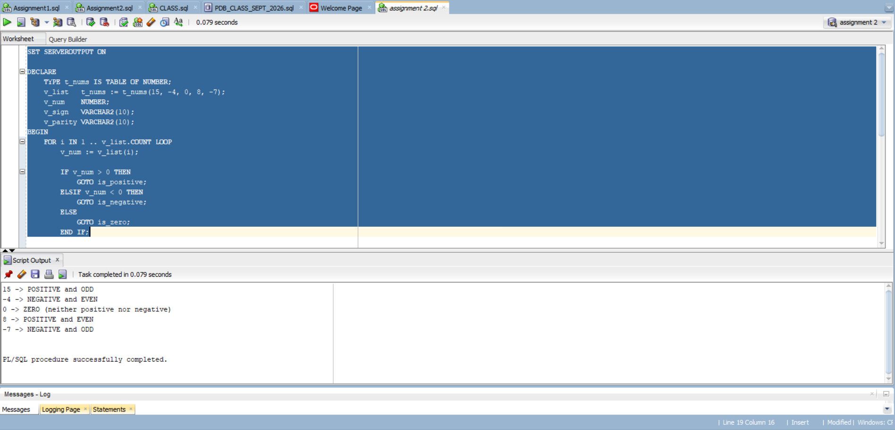
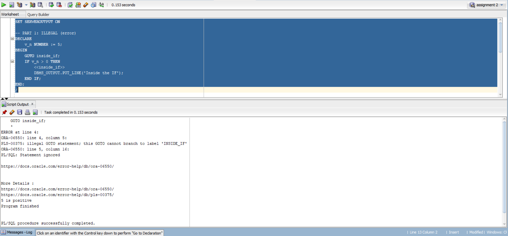
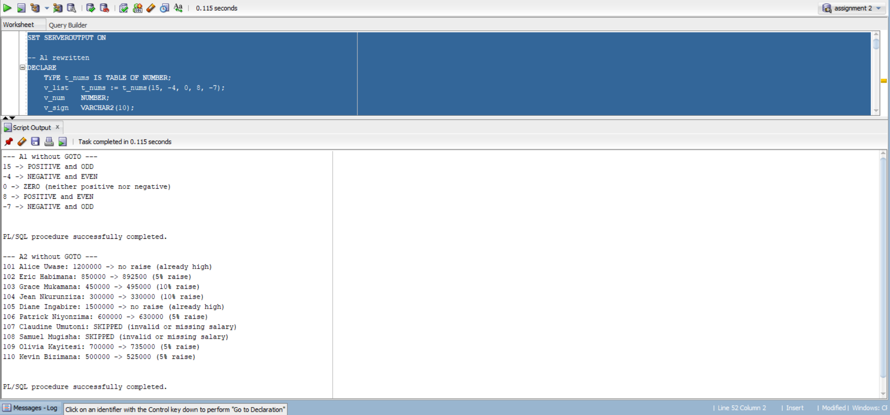
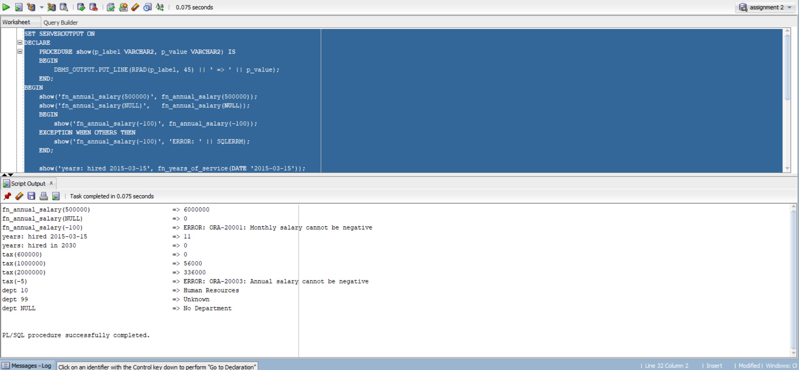
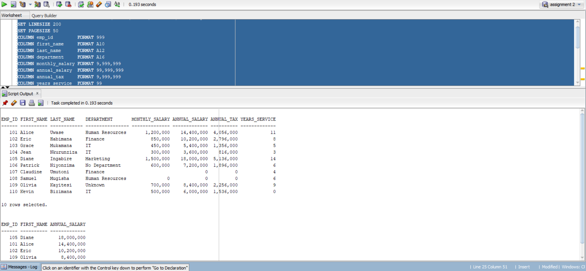
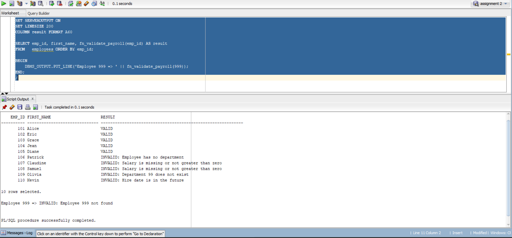

# PL/SQL GOTO Statements and Functions - Individual Assignment III

- **Course:** Database Development with PL/SQL (INSY 8311), AUCA
- **Student:** Abdelgafar (ID 28874)
- **Instructor:** Eric Maniraguha

## Project structure
| Part | Task | File |
|------|------|------|
| Setup | Tables + sample data | `00_setup/create_tables.sql` |
| A1 | Number classifier using GOTO | `01_goto/A1_number_classifier.sql` |
| A2 | Salary review using GOTO | `01_goto/A2_salary_review.sql` |
| A3 | Illegal GOTO and its fix | `01_goto/A3_illegal_goto.sql` |
| A4 | A1 and A2 rewritten without GOTO | `01_goto/A4_rewrite_no_goto.sql` |
| B1 | `fn_annual_salary` | `02_functions/B1_fn_annual_salary.sql` |
| B2 | `fn_years_of_service` | `02_functions/B2_fn_years_of_service.sql` |
| B3 | `fn_calculate_tax` | `02_functions/B3_fn_calculate_tax.sql` |
| B4 | `fn_dept_name` | `02_functions/B4_fn_dept_name.sql` |
| B5 | Functions used inside SQL | `03_tests/B5_functions_in_select.sql` |
| C1 | `fn_validate_payroll` (GOTO + functions) | `02_functions/C1_fn_validate_payroll.sql` |
| C2 | Reflection | `docs/REFLECTION.md` |

Tests: `03_tests/test_functions.sql`, `03_tests/test_validate_payroll.sql`.

## How to run
1. Run `00_setup/create_tables.sql`.
2. Run the functions in `02_functions/` in this order: B1, B2, B3, B4, then C1 (C1 depends on B1, B3, B4).
3. Run the programs in `01_goto/`.
4. Run the test files in `03_tests/`.
5. Verify your results against the screenshots below.

Use **Run Script (F5)** in SQL Developer so `DBMS_OUTPUT` appears in *Script Output*.

---

## Setup - Tables and sample data

Creates `departments` and `employees`. Some rows are intentionally invalid (no salary, zero salary, unknown department, future hire date) so the validator in C1 has something to catch.

```sql
-- =====================================================
-- 00_setup/create_tables.sql
-- Creates the DEPARTMENTS and EMPLOYEES tables + sample data
-- Some rows are intentionally "bad" so the validator (C1) has something to catch
-- =====================================================
SET SERVEROUTPUT ON

BEGIN EXECUTE IMMEDIATE 'DROP TABLE employees PURGE'; EXCEPTION WHEN OTHERS THEN NULL; END;
/
BEGIN EXECUTE IMMEDIATE 'DROP TABLE departments PURGE'; EXCEPTION WHEN OTHERS THEN NULL; END;
/

CREATE TABLE departments (
    dept_id   NUMBER(4)     PRIMARY KEY,
    dept_name VARCHAR2(50)  NOT NULL
);

-- No FK on dept_id on purpose: lets us store an invalid dept (99) to test the validator
CREATE TABLE employees (
    emp_id         NUMBER(6)     PRIMARY KEY,
    first_name     VARCHAR2(30)  NOT NULL,
    last_name      VARCHAR2(30)  NOT NULL,
    monthly_salary NUMBER(12,2),
    hire_date      DATE,
    dept_id        NUMBER(4)
);

INSERT INTO departments VALUES (10, 'Human Resources');
INSERT INTO departments VALUES (20, 'Finance');
INSERT INTO departments VALUES (30, 'IT');
INSERT INTO departments VALUES (40, 'Marketing');

INSERT INTO employees VALUES (101, 'Alice',    'Uwase',       1200000, DATE '2015-03-15', 10);
INSERT INTO employees VALUES (102, 'Eric',     'Habimana',     850000, DATE '2018-07-01', 20);
INSERT INTO employees VALUES (103, 'Grace',    'Mukamana',     450000, DATE '2021-01-10', 30);
INSERT INTO employees VALUES (104, 'Jean',     'Nkurunziza',   300000, DATE '2023-09-01', 30);
INSERT INTO employees VALUES (105, 'Diane',    'Ingabire',    1500000, DATE '2012-05-20', 40);
INSERT INTO employees VALUES (106, 'Patrick',  'Niyonzima',    600000, DATE '2019-11-11', NULL);   -- no department
INSERT INTO employees VALUES (107, 'Claudine', 'Umutoni',       NULL,  DATE '2022-02-02', 20);     -- missing salary
INSERT INTO employees VALUES (108, 'Samuel',   'Mugisha',           0, DATE '2020-06-06', 10);     -- zero salary
INSERT INTO employees VALUES (109, 'Olivia',   'Kayitesi',     700000, DATE '2017-08-08', 99);     -- dept 99 does not exist
INSERT INTO employees VALUES (110, 'Kevin',    'Bizimana',     500000, DATE '2030-01-01', 30);     -- hire date in the future

COMMIT;

SELECT * FROM departments ORDER BY dept_id;
SELECT * FROM employees   ORDER BY emp_id;
```

---

## A1 - Number Classifier (GOTO)

Classifies each number as POSITIVE / NEGATIVE / ZERO and EVEN / ODD using `GOTO` and labels.

```sql
-- =====================================================
-- A1 - Number Classifier (uses GOTO)
-- Classifies each number as POSITIVE / NEGATIVE / ZERO and EVEN / ODD
-- =====================================================
SET SERVEROUTPUT ON

DECLARE
    TYPE t_nums IS TABLE OF NUMBER;
    v_list   t_nums := t_nums(15, -4, 0, 8, -7);
    v_num    NUMBER;
    v_sign   VARCHAR2(10);
    v_parity VARCHAR2(10);
BEGIN
    FOR i IN 1 .. v_list.COUNT LOOP
        v_num := v_list(i);

        -- Step 1: decide the sign and JUMP to the right label
        IF v_num > 0 THEN
            GOTO is_positive;
        ELSIF v_num < 0 THEN
            GOTO is_negative;
        ELSE
            GOTO is_zero;
        END IF;

        <<is_positive>>
        v_sign := 'POSITIVE';
        GOTO check_parity;

        <<is_negative>>
        v_sign := 'NEGATIVE';
        GOTO check_parity;

        <<is_zero>>
        DBMS_OUTPUT.PUT_LINE(v_num || ' -> ZERO (neither positive nor negative)');
        GOTO next_number;          -- skip the parity check for zero

        -- Step 2: even or odd
        <<check_parity>>
        IF MOD(v_num, 2) = 0 THEN
            v_parity := 'EVEN';
        ELSE
            v_parity := 'ODD';
        END IF;
        DBMS_OUTPUT.PUT_LINE(v_num || ' -> ' || v_sign || ' and ' || v_parity);

        <<next_number>>
        NULL;                      -- a label must be followed by a statement
    END LOOP;
END;
/
```



---

## A2 - Salary Review (GOTO)

Skips invalid salaries, gives 10% raise below 500,000, 5% raise below 1,000,000, and no raise above. Uses `GOTO` for each branch.

```sql
-- =====================================================
-- A2 - Salary Review (uses GOTO)
-- Rules:  NULL or <= 0 salary -> skip employee
--         < 500,000           -> 10% raise
--         500,000 - 999,999   -> 5% raise
--         >= 1,000,000        -> no raise
-- Nothing is updated in the table; the program only reports the proposed salary.
-- =====================================================
SET SERVEROUTPUT ON

DECLARE
    v_pct NUMBER;
    v_new NUMBER;
BEGIN
    FOR r IN (SELECT emp_id, first_name, last_name, monthly_salary
              FROM   employees
              ORDER  BY emp_id) LOOP

        IF r.monthly_salary IS NULL OR r.monthly_salary <= 0 THEN
            GOTO skip_employee;
        END IF;

        IF r.monthly_salary < 500000 THEN
            v_pct := 10;
            GOTO apply_raise;
        ELSIF r.monthly_salary < 1000000 THEN
            v_pct := 5;
            GOTO apply_raise;
        ELSE
            GOTO no_raise;
        END IF;

        <<apply_raise>>
        v_new := r.monthly_salary * (1 + v_pct / 100);
        DBMS_OUTPUT.PUT_LINE(r.emp_id || ' ' || r.first_name || ' ' || r.last_name ||
                             ': ' || r.monthly_salary || ' -> ' || v_new ||
                             ' (' || v_pct || '% raise)');
        GOTO next_employee;

        <<no_raise>>
        DBMS_OUTPUT.PUT_LINE(r.emp_id || ' ' || r.first_name || ' ' || r.last_name ||
                             ': ' || r.monthly_salary || ' -> no raise (already high)');
        GOTO next_employee;

        <<skip_employee>>
        DBMS_OUTPUT.PUT_LINE(r.emp_id || ' ' || r.first_name || ' ' || r.last_name ||
                             ': SKIPPED (invalid or missing salary)');

        <<next_employee>>
        NULL;
    END LOOP;
END;
/
```


---

## A3 - Illegal GOTO and Fix

Part 1 jumps *into* an IF block, which is illegal (PLS-00375). Part 2 fixes it by jumping *out* of the IF to a label in the enclosing block.

```sql
-- =====================================================
-- A3 - Illegal GOTO and the Fix
-- PL/SQL does NOT allow:
--   1) jumping INTO an IF / LOOP / CASE / nested block
--   2) jumping from an exception handler back into the block body
--   3) jumping to a label that does not exist or is not in scope
-- It DOES allow jumping OUT of an IF / loop to a label in an enclosing block.
-- =====================================================
SET SERVEROUTPUT ON

-- ---------- PART 1: ILLEGAL (this block FAILS to compile) ----------
-- Expected error:  PLS-00375: illegal GOTO statement; this GOTO cannot branch to label 'INSIDE_IF'
DECLARE
    v_n NUMBER := 5;
BEGIN
    GOTO inside_if;                      -- ILLEGAL: jumps INTO the IF block
    IF v_n > 0 THEN
        <<inside_if>>
        DBMS_OUTPUT.PUT_LINE('Inside the IF');
    END IF;
END;
/

-- ---------- PART 2: THE FIX (compiles and runs) ----------
-- The label now lives in the enclosing block, and the GOTO jumps OUT of the IF.
DECLARE
    v_n NUMBER := 5;
BEGIN
    IF v_n > 0 THEN
        GOTO show_positive;              -- LEGAL: jumping out of an IF
    END IF;

    DBMS_OUTPUT.PUT_LINE(v_n || ' is not positive');
    GOTO finish;

    <<show_positive>>
    DBMS_OUTPUT.PUT_LINE(v_n || ' is positive');

    <<finish>>
    DBMS_OUTPUT.PUT_LINE('Program finished');
END;
/
```



---

## A4 - Rewrite Without GOTO

A1 and A2 rewritten with `IF/ELSIF`, `CASE` and `CONTINUE`. Same results, easier to read.

```sql
-- =====================================================
-- A4 - Rewrite A1 and A2 WITHOUT GOTO
-- Uses IF / ELSIF, CASE and CONTINUE instead of labels.
-- Same output as the GOTO versions, but easier to read.
-- =====================================================
SET SERVEROUTPUT ON

-- ---------- A1 rewritten ----------
DECLARE
    TYPE t_nums IS TABLE OF NUMBER;
    v_list   t_nums := t_nums(15, -4, 0, 8, -7);
    v_num    NUMBER;
    v_sign   VARCHAR2(10);
    v_parity VARCHAR2(10);
BEGIN
    DBMS_OUTPUT.PUT_LINE('--- A1 without GOTO ---');
    FOR i IN 1 .. v_list.COUNT LOOP
        v_num := v_list(i);

        IF v_num = 0 THEN
            DBMS_OUTPUT.PUT_LINE(v_num || ' -> ZERO (neither positive nor negative)');
        ELSE
            v_sign   := CASE WHEN v_num > 0 THEN 'POSITIVE' ELSE 'NEGATIVE' END;
            v_parity := CASE WHEN MOD(v_num, 2) = 0 THEN 'EVEN' ELSE 'ODD' END;
            DBMS_OUTPUT.PUT_LINE(v_num || ' -> ' || v_sign || ' and ' || v_parity);
        END IF;
    END LOOP;
END;
/

-- ---------- A2 rewritten ----------
DECLARE
    v_pct NUMBER;
    v_new NUMBER;
BEGIN
    DBMS_OUTPUT.PUT_LINE('--- A2 without GOTO ---');
    FOR r IN (SELECT emp_id, first_name, last_name, monthly_salary
              FROM   employees
              ORDER  BY emp_id) LOOP

        IF r.monthly_salary IS NULL OR r.monthly_salary <= 0 THEN
            DBMS_OUTPUT.PUT_LINE(r.emp_id || ' ' || r.first_name || ' ' || r.last_name ||
                                 ': SKIPPED (invalid or missing salary)');
            CONTINUE;                  -- go to next employee (replaces GOTO skip/next)
        END IF;

        IF r.monthly_salary >= 1000000 THEN
            DBMS_OUTPUT.PUT_LINE(r.emp_id || ' ' || r.first_name || ' ' || r.last_name ||
                                 ': ' || r.monthly_salary || ' -> no raise (already high)');
            CONTINUE;
        END IF;

        v_pct := CASE WHEN r.monthly_salary < 500000 THEN 10 ELSE 5 END;
        v_new := r.monthly_salary * (1 + v_pct / 100);
        DBMS_OUTPUT.PUT_LINE(r.emp_id || ' ' || r.first_name || ' ' || r.last_name ||
                             ': ' || r.monthly_salary || ' -> ' || v_new ||
                             ' (' || v_pct || '% raise)');
    END LOOP;
END;
/
```



---

## B1 - fn_annual_salary

Monthly salary x 12. NULL returns 0; a negative value raises ORA-20001.

```sql
-- =====================================================
-- B1 - fn_annual_salary: monthly salary x 12
-- NULL -> 0 ; negative -> error -20001
-- =====================================================
CREATE OR REPLACE FUNCTION fn_annual_salary (
    p_monthly_salary IN NUMBER
) RETURN NUMBER
DETERMINISTIC
IS
BEGIN
    IF p_monthly_salary IS NULL THEN
        RETURN 0;
    END IF;

    IF p_monthly_salary < 0 THEN
        RAISE_APPLICATION_ERROR(-20001, 'Monthly salary cannot be negative');
    END IF;

    RETURN p_monthly_salary * 12;
END fn_annual_salary;
/
SHOW ERRORS FUNCTION fn_annual_salary
```

---

## B2 - fn_years_of_service

Complete years since the hire date. NULL returns NULL; a future date returns 0.

```sql
-- =====================================================
-- B2 - fn_years_of_service: complete years since hire date
-- NULL hire date -> NULL ; future hire date -> 0 (has not started yet)
-- =====================================================
CREATE OR REPLACE FUNCTION fn_years_of_service (
    p_hire_date IN DATE
) RETURN NUMBER
IS
BEGIN
    IF p_hire_date IS NULL THEN
        RETURN NULL;
    END IF;

    IF p_hire_date > SYSDATE THEN
        RETURN 0;
    END IF;

    RETURN TRUNC(MONTHS_BETWEEN(SYSDATE, p_hire_date) / 12);
EXCEPTION
    WHEN OTHERS THEN
        RETURN NULL;
END fn_years_of_service;
/
SHOW ERRORS FUNCTION fn_years_of_service
```

---

## B3 - fn_calculate_tax

Progressive tax on the annual salary: 0% up to 720,000; 20% from 720,000 to 1,200,000; 30% above 1,200,000. A negative value raises ORA-20003.

```sql
-- =====================================================
-- B3 - fn_calculate_tax: progressive income tax on ANNUAL salary
-- ASSUMED brackets (edit if your instructor gave different ones):
--   up to 720,000            -> 0%
--   720,001 to 1,200,000     -> 20% of the part above 720,000
--   above 1,200,000          -> 30% of the part above 1,200,000 (+ 96,000 from the 20% band)
-- =====================================================
CREATE OR REPLACE FUNCTION fn_calculate_tax (
    p_annual_salary IN NUMBER
) RETURN NUMBER
DETERMINISTIC
IS
    c_band1 CONSTANT NUMBER := 720000;
    c_band2 CONSTANT NUMBER := 1200000;
    v_tax   NUMBER;
BEGIN
    IF p_annual_salary IS NULL THEN
        RETURN 0;
    END IF;

    IF p_annual_salary < 0 THEN
        RAISE_APPLICATION_ERROR(-20003, 'Annual salary cannot be negative');
    END IF;

    IF p_annual_salary <= c_band1 THEN
        v_tax := 0;
    ELSIF p_annual_salary <= c_band2 THEN
        v_tax := (p_annual_salary - c_band1) * 0.20;
    ELSE
        v_tax := (c_band2 - c_band1) * 0.20 + (p_annual_salary - c_band2) * 0.30;
    END IF;

    RETURN ROUND(v_tax, 2);
END fn_calculate_tax;
/
SHOW ERRORS FUNCTION fn_calculate_tax
```

---

## B4 - fn_dept_name

Returns the department name. NULL returns 'No Department'; an unknown id returns 'Unknown' (handled with `NO_DATA_FOUND`).

```sql
-- =====================================================
-- B4 - fn_dept_name: returns the department name for a dept_id
-- NULL id -> 'No Department' ; id not found -> 'Unknown'
-- =====================================================
CREATE OR REPLACE FUNCTION fn_dept_name (
    p_dept_id IN NUMBER
) RETURN VARCHAR2
IS
    v_name departments.dept_name%TYPE;
BEGIN
    IF p_dept_id IS NULL THEN
        RETURN 'No Department';
    END IF;

    SELECT dept_name
    INTO   v_name
    FROM   departments
    WHERE  dept_id = p_dept_id;

    RETURN v_name;
EXCEPTION
    WHEN NO_DATA_FOUND THEN
        RETURN 'Unknown';
END fn_dept_name;
/
SHOW ERRORS FUNCTION fn_dept_name
```

---

## Tests for B1 - B4

`03_tests/test_functions.sql` calls each function with normal values and edge cases (NULL, negative values, unknown department) and catches the custom errors.

```sql
-- =====================================================
-- test_functions.sql - tests B1 to B4 (normal + edge cases)
-- =====================================================
SET SERVEROUTPUT ON

DECLARE
    PROCEDURE show(p_label VARCHAR2, p_value VARCHAR2) IS
    BEGIN
        DBMS_OUTPUT.PUT_LINE(RPAD(p_label, 45) || ' => ' || p_value);
    END;
BEGIN
    DBMS_OUTPUT.PUT_LINE('===== B1 fn_annual_salary =====');
    show('fn_annual_salary(500000)',  fn_annual_salary(500000));   -- 6000000
    show('fn_annual_salary(NULL)',    fn_annual_salary(NULL));     -- 0
    BEGIN
        show('fn_annual_salary(-100)', fn_annual_salary(-100));
    EXCEPTION WHEN OTHERS THEN
        show('fn_annual_salary(-100)', 'ERROR: ' || SQLERRM);      -- ORA-20001
    END;

    DBMS_OUTPUT.PUT_LINE('===== B2 fn_years_of_service =====');
    show('hired 2015-03-15', fn_years_of_service(DATE '2015-03-15'));
    show('hired today',      fn_years_of_service(SYSDATE));         -- 0
    show('hired in 2030',    fn_years_of_service(DATE '2030-01-01'));-- 0
    show('NULL date',        NVL(TO_CHAR(fn_years_of_service(NULL)), 'NULL'));

    DBMS_OUTPUT.PUT_LINE('===== B3 fn_calculate_tax =====');
    show('tax(600000)  -> 0%',            fn_calculate_tax(600000));    -- 0
    show('tax(720000)  -> boundary',      fn_calculate_tax(720000));    -- 0
    show('tax(1000000) -> 20% band',      fn_calculate_tax(1000000));   -- 56000
    show('tax(1200000) -> boundary',      fn_calculate_tax(1200000));   -- 96000
    show('tax(2000000) -> 30% band',      fn_calculate_tax(2000000));   -- 336000
    BEGIN
        show('tax(-5)', fn_calculate_tax(-5));
    EXCEPTION WHEN OTHERS THEN
        show('tax(-5)', 'ERROR: ' || SQLERRM);                          -- ORA-20003
    END;

    DBMS_OUTPUT.PUT_LINE('===== B4 fn_dept_name =====');
    show('dept 10',   fn_dept_name(10));
    show('dept 30',   fn_dept_name(30));
    show('dept 99',   fn_dept_name(99));      -- Unknown
    show('dept NULL', fn_dept_name(NULL));    -- No Department
END;
/
```



---

## B5 - Functions in SQL

The functions used inside `SELECT`, `WHERE` and `ORDER BY`.

```sql
-- B5 - Functions used inside SQL (SELECT, WHERE, ORDER BY) | Abdelgafar 28874
SET LINESIZE 200
SET PAGESIZE 50
COLUMN emp_id         FORMAT 999
COLUMN first_name     FORMAT A10
COLUMN last_name      FORMAT A12
COLUMN department     FORMAT A16
COLUMN monthly_salary FORMAT 9,999,999
COLUMN annual_salary  FORMAT 99,999,999
COLUMN annual_tax     FORMAT 9,999,999
COLUMN years_service  FORMAT 99

SELECT e.emp_id, e.first_name, e.last_name,
       fn_dept_name(e.dept_id)                              AS department,
       e.monthly_salary,
       fn_annual_salary(e.monthly_salary)                   AS annual_salary,
       fn_calculate_tax(fn_annual_salary(e.monthly_salary)) AS annual_tax,
       fn_years_of_service(e.hire_date)                     AS years_service
FROM   employees e
ORDER  BY e.emp_id;

SELECT e.emp_id, e.first_name, fn_annual_salary(e.monthly_salary) AS annual_salary
FROM   employees e
WHERE  fn_annual_salary(e.monthly_salary) > 8000000
ORDER  BY fn_annual_salary(e.monthly_salary) DESC;
```



---

## C1 - Payroll Validator

Combines GOTO, functions and exception handling. Every failed check jumps to one error exit and returns `INVALID: <reason>`; otherwise it returns `VALID`.

```sql
-- =====================================================
-- C1 - fn_validate_payroll: combined task (GOTO + functions + exceptions)
-- Returns 'VALID' or 'INVALID: <reason>'
-- Needs B1, B3 and B4 to be created first.
-- =====================================================
CREATE OR REPLACE FUNCTION fn_validate_payroll (
    p_emp_id IN NUMBER
) RETURN VARCHAR2
IS
    v_salary    employees.monthly_salary%TYPE;
    v_hire      employees.hire_date%TYPE;
    v_dept      employees.dept_id%TYPE;
    v_dept_name VARCHAR2(50);
    v_annual    NUMBER;
    v_tax       NUMBER;
    v_msg       VARCHAR2(200);
BEGIN
    SELECT monthly_salary, hire_date, dept_id
    INTO   v_salary, v_hire, v_dept
    FROM   employees
    WHERE  emp_id = p_emp_id;

    -- Check 1: salary
    IF v_salary IS NULL OR v_salary <= 0 THEN
        v_msg := 'Salary is missing or not greater than zero';
        GOTO invalid_result;
    END IF;

    -- Check 2: hire date
    IF v_hire IS NULL THEN
        v_msg := 'Hire date is missing';
        GOTO invalid_result;
    ELSIF v_hire > SYSDATE THEN
        v_msg := 'Hire date is in the future';
        GOTO invalid_result;
    END IF;

    -- Check 3: department
    IF v_dept IS NULL THEN
        v_msg := 'Employee has no department';
        GOTO invalid_result;
    END IF;

    v_dept_name := fn_dept_name(v_dept);
    IF v_dept_name = 'Unknown' THEN
        v_msg := 'Department ' || v_dept || ' does not exist';
        GOTO invalid_result;
    END IF;

    -- Check 4: tax must be less than annual salary
    v_annual := fn_annual_salary(v_salary);
    v_tax    := fn_calculate_tax(v_annual);
    IF v_tax >= v_annual THEN
        v_msg := 'Calculated tax is not less than annual salary';
        GOTO invalid_result;
    END IF;

    RETURN 'VALID';

    <<invalid_result>>
    RETURN 'INVALID: ' || v_msg;
EXCEPTION
    WHEN NO_DATA_FOUND THEN
        RETURN 'INVALID: Employee ' || p_emp_id || ' not found';
    WHEN OTHERS THEN
        RETURN 'INVALID: Unexpected error - ' || SQLERRM;
END fn_validate_payroll;
/
SHOW ERRORS FUNCTION fn_validate_payroll
```



---

### C1 test script
```sql
-- =====================================================
-- test_validate_payroll.sql - tests C1 on all employees + a missing id
-- Expected: 101-105 VALID; 106 no dept; 107 no salary; 108 zero salary;
--           109 dept 99; 110 future hire date; 999 not found
-- =====================================================
SET SERVEROUTPUT ON
SET LINESIZE 200
COLUMN result FORMAT A60

SELECT emp_id, first_name, fn_validate_payroll(emp_id) AS result
FROM   employees
ORDER  BY emp_id;

BEGIN
    DBMS_OUTPUT.PUT_LINE('Employee 999 => ' || fn_validate_payroll(999));
END;
/
```

---

## C2 - Reflection
See [docs/REFLECTION.md](docs/REFLECTION.md).

## Design decisions
- **Tables:** `employees` and `departments`, with deliberately invalid sample rows for testing.
- **Tax (B3):** progressive annual brackets as described above.
- **Errors:** custom errors with `RAISE_APPLICATION_ERROR` (-20001, -20003); lookups use `NO_DATA_FOUND`.

## Notes

**AI usage declaration:** I used an AI assistant (Claude, by Anthropic) while working on this assignment. It was used to:
- explain the assignment requirements and the concepts in simple terms (GOTO rules, stored functions, exception handling);
- draft the first version of the SQL scripts, the README structure and a draft of the reflection;
- help me understand the expected output of each task and how to organise the repository and screenshots.

**What I did myself:**
- I ran every script in Oracle SQL Developer, checked the outputs and took all the screenshots.
- I tested the code, including the intentional `PLS-00375` error in A3 and the invalid employees in C1.
- I reviewed the draft of the reflection and adjusted it so that it matches what I actually did and learned.
- I understand the code and can explain it, including how each `GOTO` jumps, why A3 fails, and what each function returns.

**Assumptions:** the assignment did not specify the table structure or the tax rates, so I designed the `employees` and `departments` tables and the tax brackets in B3 myself.
